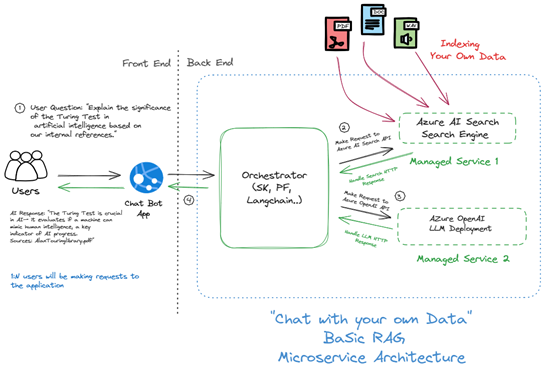
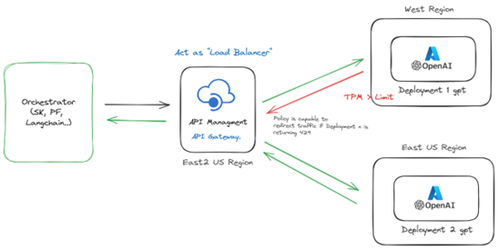
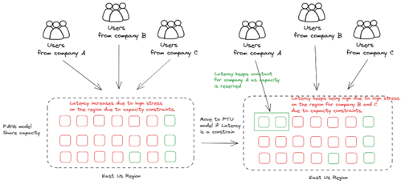
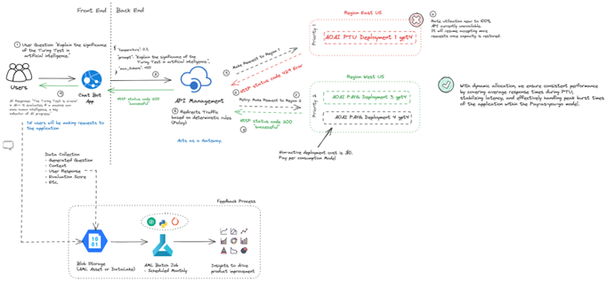

#  AOAI in Production

Transitioning from traditional, resource-intensive machine learning operations to a flexible, API-centric Model as a Service (MaaS) approach presents new challenges in the General AI Application lifecycle. This approach aligns more closely with software engineering principles, particularly in the design and development of microservices, and introduces key challenges in latency, scalability, and monitoring.

<p align="center">
    
</p>

## 🤔 Key Questions

In enterprise environments, the following questions often arise:

- 📈 **Scalability**: How can my application handle a 1000-fold increase in user interactions without encountering 'Too Many Requests' errors?
- ⚡ **Latency and Performance**: How can I reduce latency and improve system performance?
- 🚀 **Deployment and Monitoring**: What strategies can centralize deployment on a self-service platform for better monitoring and management?

These questions underscore the need for scalable, efficient AI solutions in modern software architectures. To address these, we'll provide a plan to optimize your large language model (LLM) systems with the AOIA as the reasoning engine.

## 🚀 Intro to Scalability, Monitoring, and Latency in GenAI Production

**Scalability** is tied to quota and rate limits. Services like Azure OpenAI manage this through Tokens-Per-Minute (TPM) and Requests-Per-Minute (RPM). TPM measures the volume of text processed each minute, while RPM regulates API calls to prevent system overload. By using a microservices approach, you can distribute traffic across multiple deployments to effectively increase your overall quota.

<p align="center">
    
</p>

**Monitoring and management** are crucial as AI technology advances. The rapid enhancement of Large Language Models (LLMs) like GPT-4 signals a shift towards exponential application growth. This necessitates strategic overhauls in management practices, deployment methodologies, and monitoring frameworks. We advocate for a centralized deployment strategy to refine production processes, augment monitoring capabilities, and adapt operational workflows.

**Latency** can arise from platform hardware limitations and client application design. 

🔍 **Understanding AOAI Deployment Options**:
- 💸 **PAYGO (Pay-As-You-Go)**: Charges based on actual usage with no upfront commitments, similar to a prepaid mobile phone plan.
- 📦 **Provisioned Throughput Units (PTU)**: Offers fixed-term commitment pricing, where customers purchase a set amount of throughput capacity in advance to ensure predictable and consistent service performance.

Hardware limitations significantly affect latency, especially for AOAI users experiencing fluctuations in latency throughout the day in specific regions. This is common with PAYG deployments, which function within shared capacity environments.

<p align="center">
    
</p>

Client limitations can also contribute to latency. The LLM API(AOAI) implements rate limits to preserve its limited capacity. When the rate limit is exceeded, the API responds with a 429 status code. Clients with application logic that cannot exploit the backoff signal and adapt to capacity constraints will not handle retries effectively.

<p align="center">
    
</p>

# Managing Scalability and Reliability with Azure API Management for OpenAI Endpoints

API calls often have limits set by service providers, including OpenAI. Azure OpenAI enforces token limits (TPM) and request limits (RPM). When these limits are reached, a 429 HTTP status code is returned, indicating 'Too Many Requests', along with a Retry-After response header specifying the wait time before the next request.

This document outlines a comprehensive strategy to handle these limits. It includes a well-designed user experience and workflow, application resiliency, fault-handling logic, service limit considerations, appropriate model selection, API policies, and logging and monitoring setup. The key feature is the use of Azure API Management (APIM) to expose a single endpoint to your applications while efficiently managing multiple OpenAI (or any API) backends based on availability and priority.

## Scalability vs Reliability

This solution addresses both scalability and reliability concerns. It allows your total Azure OpenAI quotas to increase and provides server-side failovers transparently for your applications. If you are looking purely for a way to increase default quotas, we recommend following the official guidance to [request a quota increase](https://learn.microsoft.com/azure/ai-services/openai/quotas-limits#how-to-request-increases-to-the-default-quotas-and-limits).

## Caching and Multiple API Management Instances

This policy uses API Management's internal cache mode, an in-memory local cache. If you have multiple API Management instances running in one region or a multi-regional deployment, each instance will have its own list of backends. This could lead to unnecessary roundtrips to throttled endpoints. To solve this, you can change API Management [to use an external Redis cache](https://learn.microsoft.com/azure/api-management/api-management-howto-cache-external) so all instances will share the same cached object.

## 💡 The "Smart" in Smart Load Balancing

What sets this APIM solution apart is its awareness of the HTTP status code 429 and the Retry-After response header. When a backend starts throttling, APIM intelligently redirects traffic to other available backends. You can set a priority order for your backends, with higher priority ones being used first until they start throttling. At that point, APIM falls back to lower priority backends.

Unlike many other APIM policies, this solution does not configure a waiting interval between attempts to call different backends. While this is a good practice on the client-side, it's not ideal on the server-side as it holds the client and consumes more APIM capacity during the wait time. With this solution, retries on the server-side are immediate and directed to a different endpoint.

## 🔄 Round-Robin Load Balancing

Round-robin load balancing is a simple method for distributing client requests across a group of servers. When a server goes down, the load balancer redirects traffic to the remaining online servers. When a new server is added to the server group, the load balancer automatically starts to send requests to it.

In this context, round-robin load balancing can be used to distribute API calls across multiple OpenAI backends. This can help to ensure that no single backend becomes a bottleneck and can improve the overall performance of your application.

## 🧠 Smart Load Balancing

Smart load balancing, on the other hand, is more sophisticated. It takes into account the current load of each server and their capacity when distributing the requests. This means that if one server is under heavy load, new requests will be sent to other servers with more capacity.

In the context of APIM, smart load balancing can be used to intelligently distribute API calls based on the availability and priority of each backend. This can help to ensure that your application remains responsive even when some backends start throttling.

Here are diagrams for a clearer understanding:

<p align="center">
    
</p>

<p align="center">
    
</p>

## 🤔 Choosing Between Round-Robin and Smart Load Balancing

The choice between round-robin and smart load balancing depends on your specific requirements. If your backends have similar capacities and you want a simple and fair distribution of requests, round-robin load balancing could be a good choice. However, if your backends have different capacities or if you want to prioritize some backends over others, smart load balancing would be more appropriate.

For example, if you have three backends with similar capacities, you could use round-robin load balancing to distribute the requests evenly. However, if one of those backends is more powerful and can handle more requests, you might want to use smart load balancing to send more requests to that backend.

### Harnessing the Power of Smart Load Balancing for Optimized PTU and PAYG Deployments

<p align="center">
    
</p>

Smart load balancing shines when dealing with different types of deployments, such as Provisioned Throughput Units (PTU) and Pay-As-You-Go (PAYGO). The concept of "priority groups" plays a crucial role here. 

Consider the following scenarios:

- **Scenario 1**: You have a PTU deployment. Since you're paying for this capacity whether you use it or not, it makes sense to consume all its capacity first. This can be set as **Priority 1**. Additionally, you have extra deployments using the default S0 tier (token-based consumption model) spread across different Azure regions. These can serve as fallbacks in case your PTU instance is fully occupied and returning 429 errors. These can be set as **Priority 2**.

- **Scenario 2**: You don't have any PTU deployment, but you have multiple S0 deployments spread across different Azure regions to handle throttling. For instance, if your applications are mostly in the USA, you can deploy one instance of OpenAI in each region of the USA that has OpenAI capacity. These can be set as **Priority 1**. If all USA instances are getting throttled, you can fall back to instances in Canada, set as **Priority 2**. If Canada also gets throttled, you can fall back to European regions, set as **Priority 3**. As a last resort, you might even consider having OpenAI endpoints in Asia, set as **Priority 4**.

In cases where multiple backends have the same priority and none of them are throttling, the algorithm will randomly pick among these URLs. This ensures that no single backend becomes a bottleneck, improving the overall performance and reliability of your application.

## :gear: Setup instructions

1. Provision an [Azure API Management instance](https://learn.microsoft.com/en-us/azure/api-management/get-started-create-service-instance) and ensure that you enable `Managed Identity` during provisioning.
2. Provision your Azure OpenAI Service instances and deploy the same models and versions in each instance, while giving them the same name (e.g., name your deployment `gpt-35-turbo` or `gpt4-8k` in each instance and select the same version, e.g., `0613`)
3. For each Azure OpenAI Service instance, we need to add the Managed Identity of the API Management. For this, goto each Azure OpenAI instance in the Azure Portal, click `Access control (IAM)`, click `+ Add`, click `Add role assignment`, select the role `Cognitive Services OpenAI User`, click Next, select `Managed Identity` under `Assign access to`, then `+ Select Members`, and select the Managed Identity of your API Management instance. 
4. Download the desired API schema for Azure OpenAI Service, e.g., version [`2023-12-01-preview`](https://raw.githubusercontent.com/Azure/azure-rest-api-specs/main/specification/cognitiveservices/data-plane/AzureOpenAI/inference/preview/2023-12-01-preview/inference.json) or [any other version](https://github.com/Azure/azure-rest-api-specs/tree/main/specification/cognitiveservices/data-plane/AzureOpenAI/inference/preview)
5. Open `inference.json` in the editor of your choice and update the `servers` section ontop:
    ```
    "servers": [
        {
        "url": "https://microsoft.com/openai",
        "variables": {
            "endpoint": {
            "default": "itdoesntmatter.openai.azure.com"
            }
        }
        }
    ],
    ```
    We won't use this, but in order to import the file into API Management, we need to a correct URL there.
6. Goto your API Management instance in the Azure Portal, then select `API` on the left side, click `+ Add API` and select `OpenAI`
7. Load your `inference.json` and click `Create`.
> [!NOTE]   
> If you are using the Azure OpenAI SDK, make sure you set the API suffix to "something/**openai**". For example, "openai-load-balancing/**openai**". This is needed because the Azure OpenAI SDK automatically appends "/openai" in the requests and if that is missing in the API suffix, API Management will return 404 Not Found. Unless you want to use the API suffix solely as "openai", then there is no need to duplicate like "openai/openai".
8. Select the new API, goto `Settings`, goto `Subscription` and ensure `Subscription required` is checked and `Header name` is set to `api-key`. This is important to ensure compatibility with the OpenAI SDK.
9. Now edit `apim-policy.xml` from this repo and update the backend section as needed:
    ```
    backends.Add(new JObject()
    {
        { "url", "https://andre-openai-eastus.openai.azure.com/" },
        { "priority", 1},
        { "isThrottling", false }, 
        { "retryAfter", DateTime.MinValue } 
    });
    ...
    ```
    Make sure you add all the Azure OpenAI instances you want to use and assign them the desired priority.
10. Goto back to API Management, select `Design`, select `All operations` and click the `</>` icon in inbound processing. Replace the code with the contents of your `apim-policy.xml`, then hit `Save`.
11. Lastly, goto `Subscriptions` (left menu) in API Management, select `+ Add Subscription`, give it a name and scope it `API` and select your `Azure OpenAI Service API`, click `Create`.
12. Then test if everything works by running some code of your choice, e.g., this code with OpenAI Python SDK:
    ```python
    from openai import AzureOpenAI

    client = AzureOpenAI(
        azure_endpoint="https://<your_APIM_endpoint>.azure-api.net/<your_api_suffix>", #do not add "/openai" at the end here because this will be automatically added by this SDK
        api_key="<your subscription key>",
        api_version="2023-12-01-preview"
    )

    response = client.chat.completions.create(
        model="<your_deployment_name>",
        messages=[
            {"role": "system", "content": "You are a helpful assistant."},
            {"role": "user", "content": "Does Azure OpenAI support customer managed keys?"}
        ]
    )
    print(response)
    ```

## :page_with_curl: Working with the policy

I'm using [API Management policies](https://learn.microsoft.com/azure/api-management/api-management-howto-policies) to define all this logic. API Management doesn't have built-in support for this scenario but by using custom policies we can achieve it. Let's take a look in the most important parts of the policy:

```xml
<set-variable name="listBackends" value="@{
    // -------------------------------------------------
    // ------- Explanation of backend properties -------
    // -------------------------------------------------
    // "url":          Your backend url
    // "priority":     Lower value means higher priority over other backends. 
    //                 If you have more one or more Priority 1 backends, they will always be used instead
    //                 of Priority 2 or higher. Higher values backends will only be used if your lower values (top priority) are all throttling.
    // "isThrottling": Indicates if this endpoint is returning 429 (Too many requests) currently
    // "retryAfter":   We use it to know when to mark this endpoint as healthy again after we received a 429 response

    JArray backends = new JArray();
    backends.Add(new JObject()
    {
        { "url", "https://andre-openai-eastus.openai.azure.com/" },
        { "priority", 1},
        { "isThrottling", false }, 
        { "retryAfter", DateTime.MinValue } 
    });

    backends.Add(new JObject()
    {
        { "url", "https://andre-openai-eastus-2.openai.azure.com/" },
        { "priority", 1},
        { "isThrottling", false },
        { "retryAfter", DateTime.MinValue }
    });

    backends.Add(new JObject()
    {
        { "url", "https://andre-openai-canadaeast.openai.azure.com/" },
        { "priority", 2},
        { "isThrottling", false },
        { "retryAfter", DateTime.MinValue }
    });

    backends.Add(new JObject()
    {
        { "url", "https://andre-openai-francecentral.openai.azure.com/" },
        { "priority", 3},
        { "isThrottling", false },
        { "retryAfter", DateTime.MinValue }
    });

    return backends;   
}" />
```

The variable `listBackends` at the beginning of the policy is the **only thing you need to change** to configure your backends and their priorities. In the above sample, we are telling API Management to consume US endpoints first (priority 1) and then falling back to Canada East (priority 2) and then France Central region (priority 3). We will use this array of JSON objects in API Management cache to share this property in the scope of all other incoming requests and not only in the scope of the current request. 

```xml
<authentication-managed-identity resource="https://cognitiveservices.azure.com" output-token-variable-name="msi-access-token" ignore-error="false" />
<set-header name="Authorization" exists-action="override">
    <value>@("Bearer " + (string)context.Variables["msi-access-token"])</value>
</set-header>
```

This part of the policy is injecting the Azure Managed Identity from your API Management instance as a HTTP header towards OpenAI. I highly recommend you do this because you don't need to keep track of different API-Keys for each backend. You just need to [turn on managed identity in API Management](https://learn.microsoft.com/azure/api-management/api-management-howto-use-managed-service-identity#create-a-system-assigned-managed-identity) and then [allow that identity in Azure OpenAI](https://learn.microsoft.com/azure/ai-services/openai/how-to/managed-identity)

Now let's explore and understand the other important pieces of this policy (nothing you need to change but good to be aware of):

```xml
<set-variable name="listBackends" value="@{
    JArray backends = (JArray)context.Variables["listBackends"];

    for (int i = 0; i < backends.Count; i++)
    {
        JObject backend = (JObject)backends[i];

        if (backend.Value<bool>("isThrottling") && DateTime.Now >= backend.Value<DateTime>("retryAfter"))
        {
            backend["isThrottling"] = false;
            backend["retryAfter"] = DateTime.MinValue;
        }
    }

    return backends; 
}" />
```

This piece of policy is called before every time we call OpenAI. It is just checking if any of the backends can be marked as healthy (not throttling) after we waited for the time specified in the "Retry-After" header.

```xml
<when condition="@(context.Response != null && (context.Response.StatusCode == 429 || context.Response.StatusCode.ToString().StartsWith("5")) )">
    <cache-lookup-value key="listBackends" variable-name="listBackends" />
    <set-variable name="listBackends" value="@{
        JArray backends = (JArray)context.Variables["listBackends"];
        int currentBackendIndex = context.Variables.GetValueOrDefault<int>("backendIndex");
        int retryAfter = Convert.ToInt32(context.Response.Headers.GetValueOrDefault("Retry-After", "10"));

        JObject backend = (JObject)backends[currentBackendIndex];
        backend["isThrottling"] = true;
        backend["retryAfter"] = DateTime.Now.AddSeconds(retryAfter);

        return backends;      
    }" />
```

This code is executed when there is a error 429 or 5xx coming from OpenAI. In case of errors 429, we will mark this backend as throttling and read the "Retry-After" header and add the number of seconds to wait before this is marked as not-throttling again. In case of unexpected 5xx errors, the waiting time will be 10 seconds.

There are other parts of the policy in the sources but these are the most relevant. The original [source XML](apim-policy.xml) you can find in this repo contains comments explaining what each section does.

### Scalability vs Reliability
This solution addresses both scalability and reliability concerns by allowing your total Azure OpenAI quotas to increase and providing server-side failovers transparently for your applications. However, if you are looking purely for a way to increase default quotas, I still would recommend that you follow the official guidance to [request a quota increase](https://learn.microsoft.com/azure/ai-services/openai/quotas-limits#how-to-request-increases-to-the-default-quotas-and-limits).

### Caching and multiple API Management instances
This policy is currently using API Management internal cache mode. That is a in-memory local cache. What if you have API Management running with multiple instances in one region or a multi-regional deployment? The side effect is that each instance will have its own list of backends. What might happen during runtime is this:
- API Management instance 1 receives a customer request and gets a 429 error from backend 1. It marks that backend as unavailable for X seconds and then reroute that customer request to next backend
- API Management instance 2 receives a customer request and sends that request again to backend 1 (since its local cached list of backends didn't have the information from API Management instance 1 when it marked as throttled). Backend 1 will respond with error 429 again and API Management instance 2 will also mark it as unavailable and reroutes the request to next backend

So, it might occur that internally, API Management instances will try route to throttled backends and will need to retry to another backend. Eventually, all instances will be in sync again at a small cost of unnecessary roundtrips to throttled endpoints.
I honestly think this is a very small price to pay, but if you want to solve that you can always change API Management [to use an external Redis cache](https://learn.microsoft.com/azure/api-management/api-management-howto-cache-external) so all instances will share the same cached object.

## :question: FAQ

### I don't know anything about API Management. Where and how I add this code?
You just need to copy the contents of the [policy XML](apim-policy.xml), modify the backends list (from line 21 to 83) and paste into one of your APIs policies. There is an easy tutorial on how to do that [here](https://learn.microsoft.com/azure/api-management/set-edit-policies?tabs=form).

### What happens if all backends are throttling at the same time?
In that case, the policy will return the first backend in the list (line 158) and will forward the request to it. Since that endpoint is throttling, API Management will return the same 429 error as the OpenAI backend. That's why it is **still important for your client application/SDKs to have a logic to handle retries**, even though it should be much less frequent.

### I am updating the backend list in the policies but it seems to keep the old list
That is because the policy is coded to only create the backend list after it expires in the internal cache, after 60 seconds. That means if your API Management instance is getting at least one request every 60 seconds, that cache will not expire to pick up your latest changes. You can either manually remove the cached "listBackends" key by using [cache-remove-key](https://learn.microsoft.com/azure/api-management/cache-remove-value-policy) policy or call its Powershell operation to [remove a cache](https://learn.microsoft.com/powershell/module/az.apimanagement/remove-azapimanagementcache?view=azps-10.4.1)

### Reading the policy logic is hard for me. Can you describe it in plain english?
Sure. That's how it works when API Management gets a new incoming request:

1. From the list of backends defined in the JSON array, it will pick one backend using this logic:
   1. Selects the highest priority (lower number) that is not currently throttling. If it finds more than one healthy backend with the same priority, it will randomly select one of them
2. Sends the request to the chosen backend URL
    1. If the backend responds with success (HTTP status code 200), the response is passed to the client and the flow ends here
    2. If the backend responds with error 429 or 5xx
        1. It will read the HTTP response header "Retry-After" to see when it will become available again
        2. Then, it marks that specific backend URL as throttling and also saves what time it will be healthy again
        3. If there are still other available backends in the pool, it runs again the logic to select another backend (go to the point 1. again and so on)
        4. If there are no backends available (all are throttling), it will send the customer request to the first backend defined in the list and return its response

### Are you sure that not having a waiting delay in API Management between the retries is the best way to do? I don't see a problem if client needs to wait more to have better chances to get a response.
Yes. Retries with exponential backoffs are a good fit for client applications and not servers/backends. Especially in this case, in which we need to buffer the HTTP body contents between the retries (```<forward-request buffer-request-body="true" />```), spending more time before sending the response has a heavy cost. To prove that point, I did an experiment: in a given API Management instance, I made a JMeter load testing script that will call it 4000 times per minute:
- One endpoint (called "No retry" in the image below) will just return HTTP status code 200 immediately
- The second endpoint (called "Retry in APIM" in the image below) will respond the same thing but it takes 30 seconds before doing so. In that mean time, the client keeps "waiting" and connection is kept open

Check the difference in the API Management capacity metric with the same number of  minute:


The left part of the chart shows 20% average capacity for 4K RPM with API Management sends the response immediately. The right part of the chart shows 60% average capacity utilization with the same 4K RPM! Just because it holds the connection longer. That's 3 times more! The same behavior will happen if you configure API Management retries with waiting times: you will add extra pressure and it even might become a single point of failure in high traffic situations.

## :link: Related articles
- A more detailed and user-friendly step-by-step article by [csiebler](https://github.com/csiebler): [Smart Load-Balancing for Azure OpenAI with Azure API Management](https://clemenssiebler.com/posts/smart-loadbalancing-for-azure-openai-with-api-management/)
